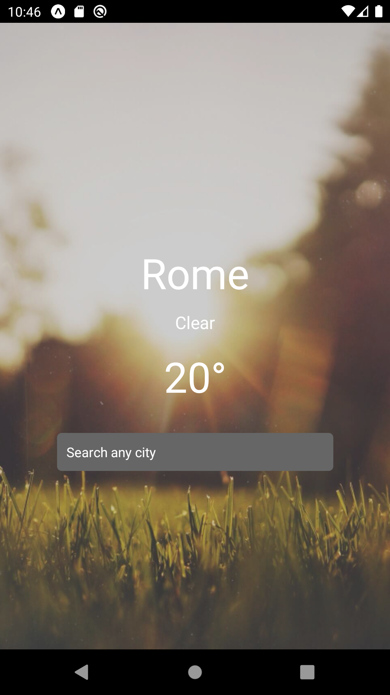
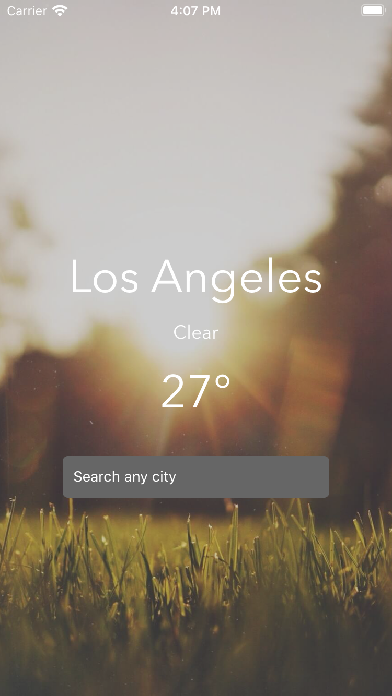
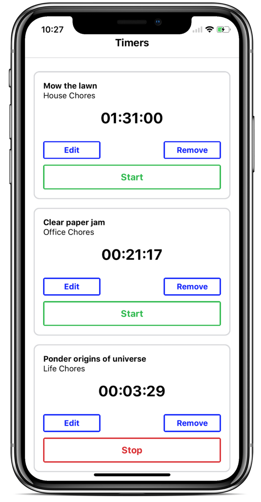

# Fullstack React Native The Complete Guide to React

This repo contains all the projects explained in the book. Feel free to star and share! :) 
 

### Weather 

The app retrieves via rest API the current weather and temperature of the chosen city.

      
    

### Time tracker

It allows to setup tasks and track their time. 

      

